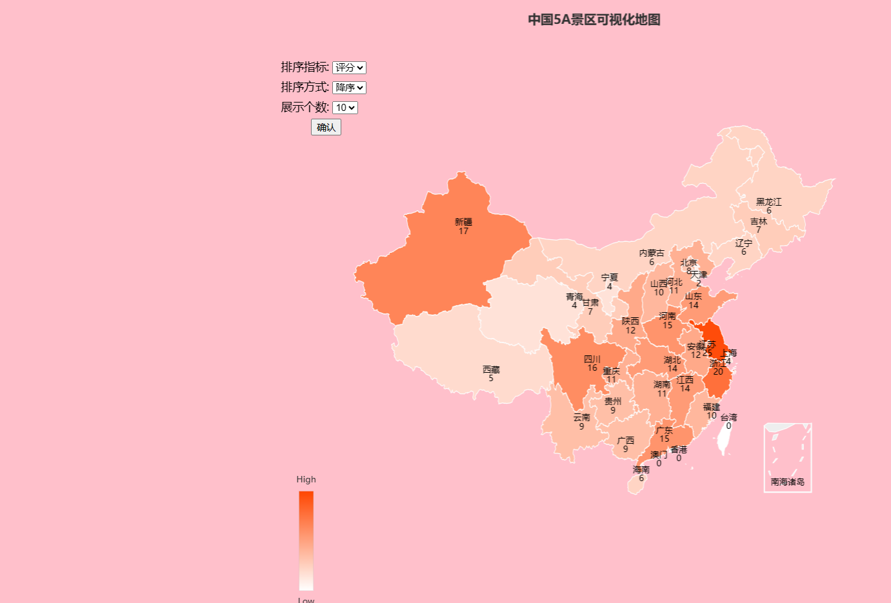
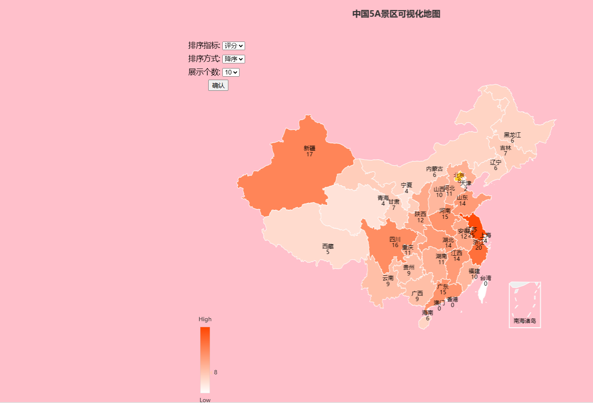
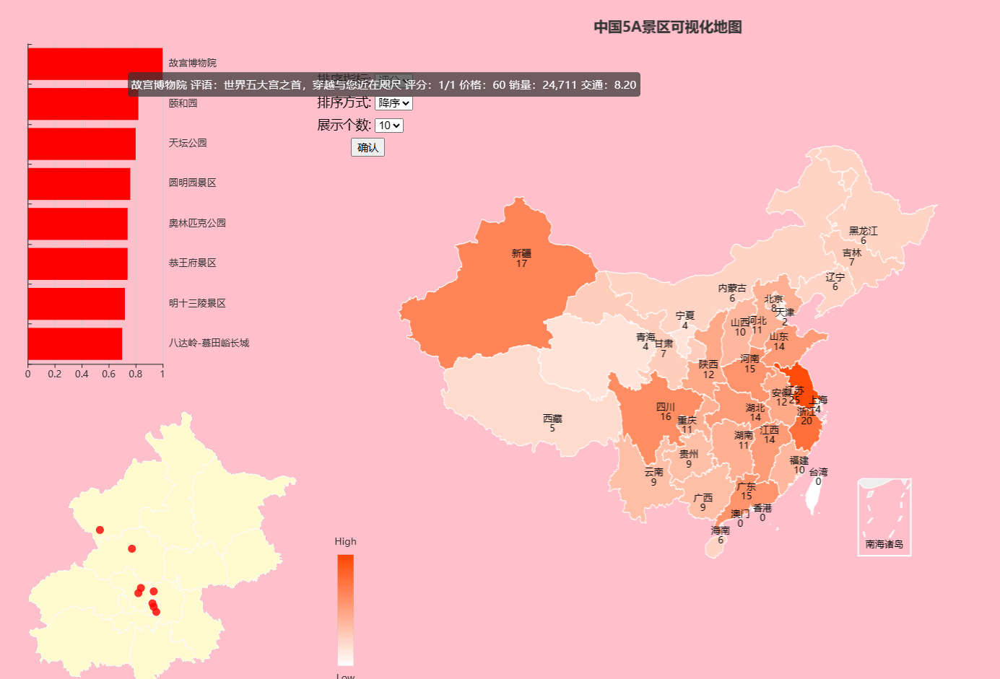
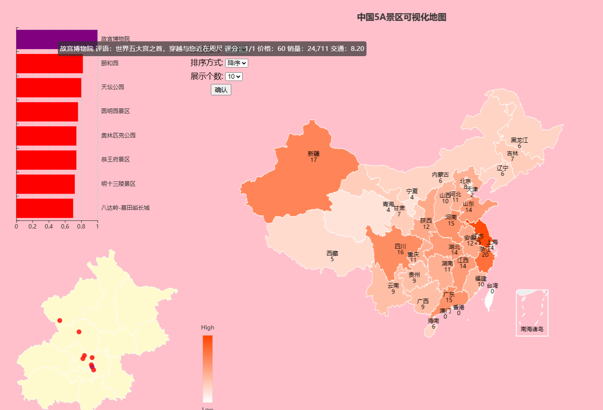
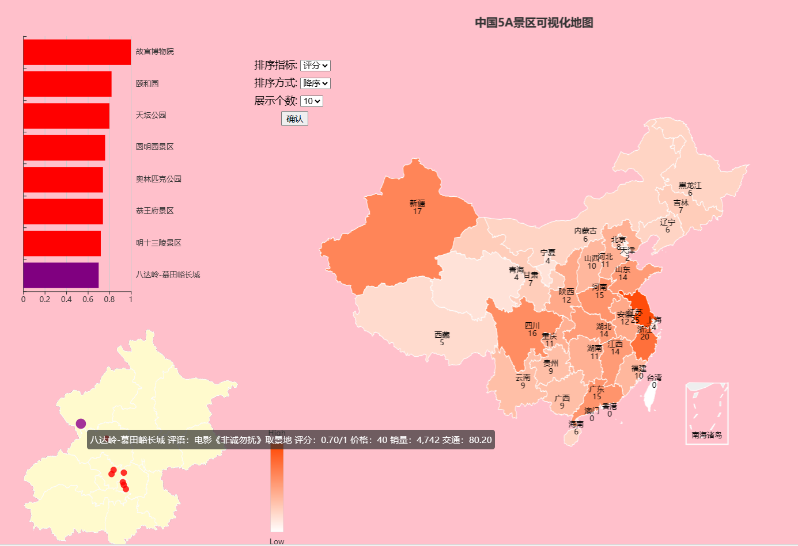
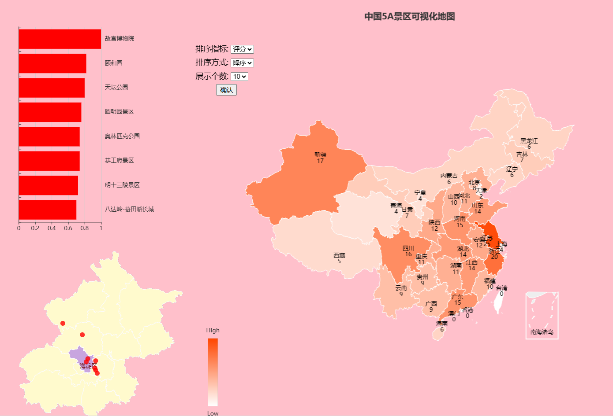
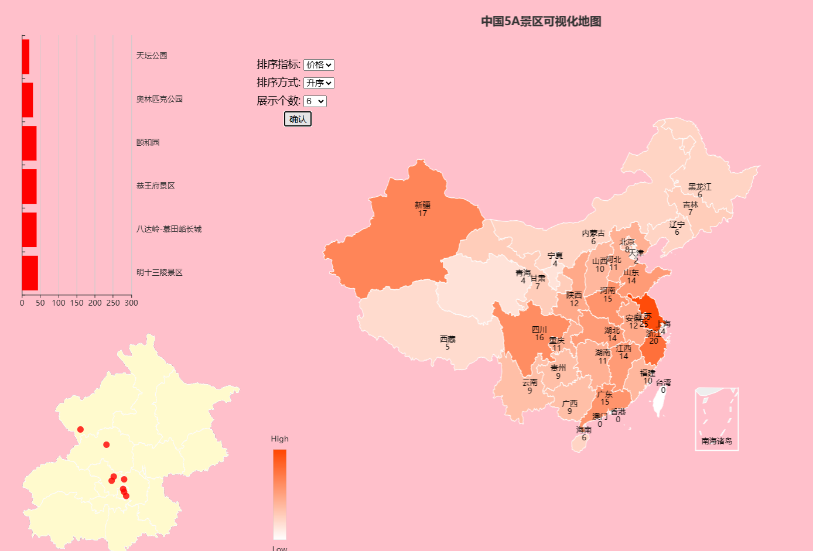

# China Map 5A Coursework

This coursework explores 5A attractions in China with a visualization page.

- **Enter the Page:** Open the page using tools like Live Server.

- **Hover on Beijing:** When hovering over Beijing, its color turns yellow.

- **Click Beijing:** Clicking on Beijing reveals a sidebar containing a bar plot and scatter plot.

- **Hover on the Palace Museum in Bar Plot:** When hovering over the Palace Museum in the bar plot, a tooltip displays its information.

- **Click the Palace Museum in Bar Plot:** Clicking on the Palace Museum in the bar plot turns the bar and the corresponding icon in the scatter plot purple.

- **Click the Great Wall in Scatter Plot:** Clicking on the Great Wall icon in the scatter plot turns the icon and the corresponding bar in the bar plot purple.

- **Hover on Haidian:** When hovering over Haidian, its scope turns purple.

- **Set the Selector:** Choose to sort by price and select the smaller 6 items.

